<h2 align="left">Name: Muhsil NR</h2>

  <a href="https://www.instagram.com/muhsilnr/?hl=en" style="text-decoration: none; color: inherit; display: inline-flex; align-items: center; gap: 8px;">
    
    @muhsilnr
  </a>

###
###

  
  
  
  
  
  
  
  
  
  
  
  
  
  
  
  
  
  
  
  
  
  
  
  

###

  <h3><code>mhlohh ~ $ ./contributions.sh</code></h3>
    

    

  <h3><code>@mhlohh ~ $ whoami</code></h3>
    <table>
      <tr>
        <td valign="top"></td>
        <td valign="top"></td>
      </tr>
    </table>

###
